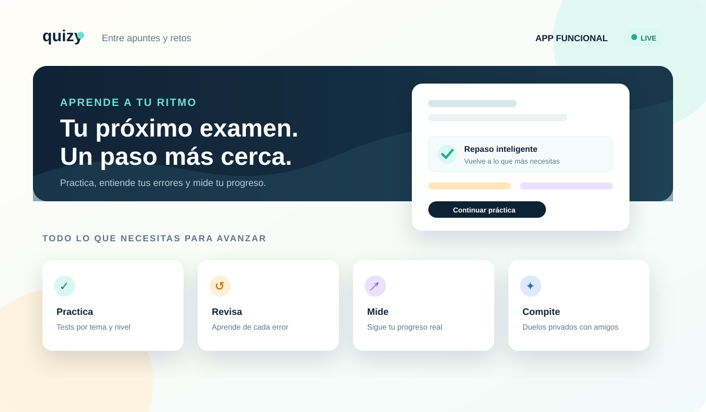

  

  

  
  
  

  

 

## Hola, soy Ángel

Soy **Ingeniero de Software por la Universidad de Málaga** y desarrollo aplicaciones full stack con un interés especial en la **IA aplicada**. Me gusta convertir problemas reales en productos claros: interfaces que se entienden, APIs que aguantan y automatizaciones que ahorran trabajo.

Actualmente estoy abierto a oportunidades de **desarrollo full stack, backend e IA aplicada**, principalmente en Málaga.

## Cómo trabajo

  

Producto · ingeniería · IA aplicada — tres capas para convertir una idea en algo que la gente puede usar.

## Stack tecnológico

<table>
  <tr>
    <td width="50%" valign="top">
      <h3 align="center">Frontend & producto</h3>
      
       Interfaces claras, responsive y orientadas a producto.
    </td>
    <td width="50%" valign="top">
      <h3 align="center">Backend & APIs</h3>
      
       Servicios mantenibles, integraciones y automatización.
    </td>
  </tr>
  <tr>
    <td width="50%" valign="top">
      <h3 align="center">Datos & entorno</h3>
      
       Datos bien estructurados y flujos de trabajo reproducibles.
    </td>
    <td width="50%" valign="top">
      <h3 align="center">Mobile & calidad</h3>
      
       Aplicaciones móviles, pruebas y mejora continua.
    </td>
  </tr>
</table>

## Producto principal · Quizy

<table>
  <tr>
    <td width="58%" valign="middle">
      
    </td>
    <td width="42%" valign="middle">
      <h3>Del primer test al «ahora lo entiendo»</h3>
      
<strong>Quizy</strong> es una app educativa funcional, versionada y en producción que he diseñado, desarrollado y lanzado para que estudiantes de ESO, Bachillerato y universidad practiquen con tests de su temario, entiendan sus errores y vean cómo avanzan.

      

        
        
        
      

      
<strong>Incluye:</strong> práctica por temas, repaso de errores, simulacros, favoritos, historial, planes de estudio y duelos privados.

      

        
        
        
        
      

      
<a href="https://www.quizy.es/"><strong>Entrar en Quizy →</strong></a>

    </td>
  </tr>
</table>

## Más proyectos

<table>
  <tr>
    <td width="50%" valign="top">
      <h3 align="center">GestorIA</h3>
      
      

        
        
      

      
Aplicación de escritorio para asesorías: clientes, tareas, control horario, facturación y un asistente conectado a los datos del negocio.

    </td>
    <td width="50%" valign="top">
      <h3 align="center">UmaRoyalFlush</h3>
      
      

        
        
      

      
Experiencia web de póker, blackjack y slots, con foco en interfaz, navegación y una experiencia de juego visual.

    </td>
  </tr>
  <tr>
    <td width="50%" valign="top">
      <h3 align="center">Calendar</h3>
      
      

        
        
      

      
Proyecto web desplegado con Next.js, TypeScript y React. <strong><a href="https://calendar-blue-six.vercel.app">Abrir demo →</a></strong>

    </td>
    <td width="50%" valign="top">
      <h3 align="center">Aitana</h3>
      
      

        
        
      

      
Proyecto web construido sobre WordPress, con personalización de tema, contenido multimedia y desarrollo frontend.

    </td>
  </tr>
</table>

<a href="https://github.com/JustBeWell?tab=repositories"><strong>Ver todos mis repositorios →</strong></a>

## Un vistazo a GitHub

  
  

  

## Experiencia que aporto

En **VIEWNEXT** trabajé en proyectos para **Cajamar e Iberdrola**, creando automatizaciones con agentes de IA para generar y validar componentes reutilizables y desarrollando aplicaciones iOS con pruebas unitarias y de integración.

También impartí clases de **Java, programación orientada a objetos, bases de datos y SQL** entre marzo de 2025 y julio de 2026.

## Ahora mismo

- Construyendo productos full stack con especial atención a la experiencia de usuario.
- Investigando cómo integrar agentes de IA de forma útil, segura y mantenible.
- Abierto a colaborar en proyectos que tengan un problema interesante detrás.

## Hablemos

Si buscas un desarrollador para un equipo de **full stack, backend o IA aplicada**, puedes escribirme por [LinkedIn](https://www.linkedin.com/in/%C3%A1ngel-nicol%C3%A1s-esca%C3%B1o-l%C3%B3pez-32031426b/) o a **[byanicoyt@gmail.com](mailto:byanicoyt@gmail.com)**.

  Hecho con curiosidad, código y muchas iteraciones · Málaga, España

