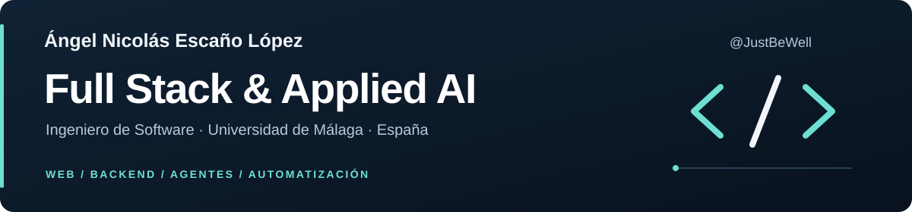

  

  <a href="https://www.linkedin.com/in/%C3%A1ngel-nicol%C3%A1s-esca%C3%B1o-l%C3%B3pez-32031426b/"><strong>LinkedIn</strong></a>
  &nbsp; · &nbsp;
  <a href="https://www.quizy.es/"><strong>Quizy en vivo</strong></a>
  &nbsp; · &nbsp;
  <a href="mailto:byanicoyt@gmail.com"><strong>Contacto</strong></a>

## Hola, soy Ángel

Soy **Ingeniero de Software por la Universidad de Málaga**. Desarrollo aplicaciones full stack e integro inteligencia artificial en productos y procesos de desarrollo: desde una plataforma educativa con usuarios reales hasta asistentes conectados a datos y flujos con agentes de IA.

Actualmente busco oportunidades de **desarrollo full stack e IA aplicada, principalmente en Málaga**.

## Proyectos destacados

### [Quizy](https://www.quizy.es/) · Plataforma educativa

Plataforma de cuestionarios que creé y lancé, con **más de 300 usuarios registrados y más de 1.000 preguntas**, rankings e historial de intentos.

- Desarrollo de frontend y API con **Next.js, React y PostgreSQL**.
- Trabajo reciente en autorización, revocación de sesiones JWT, límites de peticiones y saneamiento de contenido, con pruebas en **Vitest y Playwright**.

[Probar Quizy →](https://www.quizy.es/)

### [GestorIA](https://github.com/JustBeWell/GestorIA) · Gestión para asesorías con IA

Mi Trabajo de Fin de Grado: una aplicación de escritorio que reúne clientes, tareas, control horario, facturación y asistencia con IA.

- **Angular y Electron** en la interfaz; **Python, FastAPI y PostgreSQL** en el backend.
- Asistente con **OpenAI y llamadas a funciones** para consultar datos del negocio.
- Servicios con **Docker Compose y nginx**, permisos por roles, autenticación de dos factores y pruebas automatizadas.

[Explorar el código y la documentación →](https://github.com/JustBeWell/GestorIA)

### [Arkham Med](https://github.com/WayneEnterprrises/DatathonUMA25) · IA aplicada a salud

Prototipo de asistente clínico desarrollado en equipo, con el que obtuvimos el **primer premio en Dedalus Datathon Andalucía 2025**.

- **Python y Streamlit**, integración de LLM y consultas a literatura científica en **PubMed**.
- Acceso a datos con **SQLAlchemy y SQLite**, y visualizaciones con **Plotly**.

[Ver el proyecto del equipo →](https://github.com/WayneEnterprrises/DatathonUMA25)

## Experiencia que aporto

En **VIEWNEXT** trabajé en proyectos para **Cajamar e Iberdrola**: automatización con agentes de IA para generar y validar componentes reutilizables, y desarrollo iOS con pruebas unitarias y de integración. Esa experiencia conecta ingeniería de software, gestión de contexto y calidad del código generado.

También impartí clases de **Java, programación orientada a objetos, bases de datos y SQL** entre marzo de 2025 y julio de 2026.

## Tecnologías con las que trabajo

| Área | Tecnologías y prácticas |
| --- | --- |
| Frontend | React, Next.js, Angular, JavaScript, TypeScript |
| Backend y datos | Python, FastAPI, APIs REST, SQL, PostgreSQL |
| IA aplicada | OpenAI API, LLM, agentes, prompt engineering, gestión de contexto |
| Calidad e infraestructura | Git, Docker Compose, nginx, pytest, Vitest, Playwright |
| Desarrollo móvil | Swift, SwiftUI, UIKit, Kotlin, Jetpack Compose |

## Hablemos

Si buscas un desarrollador para un equipo de **full stack, backend o IA aplicada**, puedes escribirme por [LinkedIn](https://www.linkedin.com/in/%C3%A1ngel-nicol%C3%A1s-esca%C3%B1o-l%C3%B3pez-32031426b/) o a **[byanicoyt@gmail.com](mailto:byanicoyt@gmail.com)**.
